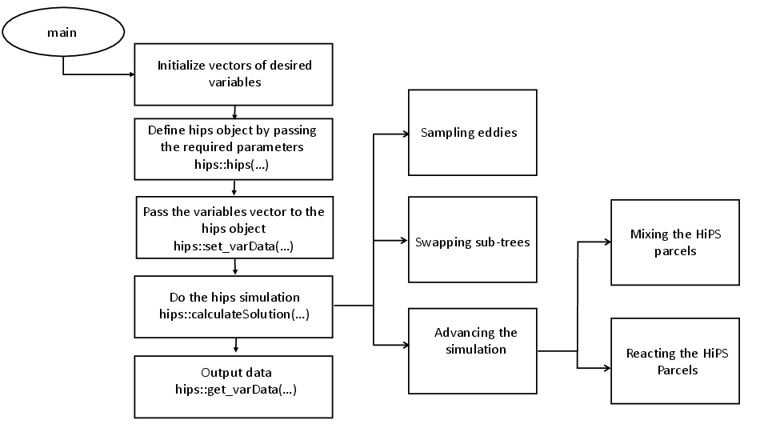

\mainpage

<!-- #################################################################### -->

# Overview

[HiPS] is an open-source C++ library that serves as both a standalone mixing model and a sub-grid model for Transported Probability Distribution Functions.

# Dependencies and installation

The code is intended to be built and used on Linux-like systems, including MacOS and the Linux subsystem for Windows.

## Required software:
* CMake 3.15+
* C++11
 
## Optional software:
* Cantera and Sundials (for reaction)
* Doxygen (for building documentation)
* Graphviz (for Doxygen)

## Build and installation instructions
1. Create and navigate into a top-level `build` directory
2. Configure CMake: `cmake ..`
3. Build HiPSlib: `make`
4. Install HiPSlib: `make install`
5. Make documentation: `make docs`

## CMake configuration variables

The default CMake configuration should be adequate for users that do not immediately require the examples, tests, or documentation. CMake configuration options can be set by editing the top-level `CMakeLists.txt` file, editing the `CMakeCache.txt` file (generated in the `build` directory after running CMake at least once), or specifying them on the command line during step 2 as follows:
```
cmake -DHIPSLIB_BUILD_EXAMPLES=ON ..
```

The following project-specific CMake configuration variables can be specified by the user; their default values are also indicated.
| CMake variable | Default | Description |
| ----------- | ----- | ------ |
| `CMAKE_INSTALL_PREFIX`   | top-level project directory | Installation location |
| `REACTIONS_ENABLED` | `OFF` | Whether to enable support for chemical reactions within the HiPS library |
| `HIPSLIB_BUILD_EXAMPLES` | `OFF` | Builds HiPS examples |
| `HIPSLIB_BUILD_DOCS`     | `OFF` | Builds HiPS documentation via Doxygen |

The `REACTIONS_ENABLED` flag determines whether the HiPS library supports chemical reactions. When set to   `ON`, the library includes functionality for reactions, requiring additional libraries like Contra or Sundials. When set to `OFF`, only simple mixing is supported, and these additional libraries are not needed. Users can adjust this flag based on whether they require reaction support and have the necessary libraries installed.


# Using HiPS

The HiPS library consists of three main object classes that users can interact with: `hips`, `batchReactor_cvode`, and `batchReactor_cantera`. These classes serve as the computational engine responsible for advancing the reaction system through time, solving complex sets of differential equations.

## Example Workflow

To integrate HiPS into C++ code, include the `hips.h` header file. Users interact with HiPS through four functions. The first function is `hips(...)` constructor which requires essential parameters such as the number of levels, length scale, time scale, variables count, a Cantera solution object (if reactions are involved), and a reaction flag to initialize an instance of the HiPS class with the provided parameters. The second function, `set_varData(...)`, is used to pass vectors of parcels containing desired variable values to the tree (e.g. concentrations, enthalpy, etc.). The third function, `calculateSolution(...)`, executes calculations and simulations. Finally, to retrieve results, users employ `get_varData(...)`. For comprehensive implementation guidance and insights into HiPS functionality, a workflow diagram is provided. 

## Implementation Guidelines

To implement a HiPS simulation based on this example in an academic setting, adhere to the following guidelines:

- Compile the code, ensuring all necessary libraries and dependencies are correctly linked.
- Execute the compiled binary to initiate the HiPS simulation with the specified parameters.
- Monitor the simulation progress and analyze the output for relevant information.

Researchers may customize parameters and mechanisms based on specific simulation requirements within the confines of this methodological framework.

## Examples

Example files are documented on the \ref examples page.
